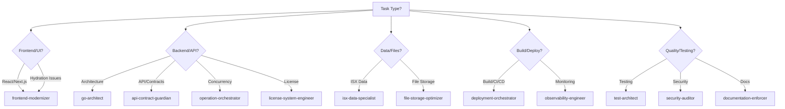

# Agent Workflow Guide for ISX Daily Reports Scrapper (v3.0)

## Overview
This document defines the systematic approach for selecting and using specialized Claude Code agents for development tasks. The system has been enhanced to 19 core agents with Opus 4.1 model for high-complexity tasks, strict CLAUDE.md compliance, and industry best practices enforcement.

## Quick Agent Selection Guide

### 🎯 THE 19 CORE AGENTS (v3.0)

**🔥 High-Complexity Agents (Opus 4.1 Model)**
These agents use `claude-opus-4-1-20250805` for complex decision-making:
- **go-architect** - System design with CLAUDE.md enforcement
- **security-auditor** - OWASP compliance & security reviews
- **api-contract-guardian** - SSOT & RFC 7807 enforcement
- **deployment-orchestrator** - BUILD_RULES.md guardian

**Architecture & Design**
1. **go-architect** (v2.0.0) ⚡ Opus 4.1 - Architecture & system design with CLAUDE.md enforcement

**Implementation**  
2. **frontend-modernizer** (v1.1.0) - ALL React/Next.js/UI work + hydration
3. **react-hydration-guardian** (v1.0.0) 🆕 - React hydration error prevention
4. **operation-orchestrator** (v1.1.0) - Pipelines, concurrency & performance
5. **api-contract-guardian** (v2.0.0) ⚡ Opus 4.1 - API design & SSOT enforcement
6. **error-recovery-specialist** (v1.0.0) 🆕 - Resilience & error recovery patterns

**Data Management**
7. **file-storage-optimizer** (v1.0.1) - CSV/Excel file optimization
8. **isx-data-specialist** (v1.0.0) - ISX-specific data & Arabic content
9. **data-migration-specialist** (v1.0.0) - Schema migrations & transformations

**Quality & Compliance**
10. **test-architect** (v1.0.0) - Testing strategy & implementation
11. **integration-test-orchestrator** (v1.0.0) 🆕 - E2E & integration testing
12. **security-auditor** (v2.0.0) ⚡ Opus 4.1 - Security & OWASP compliance
13. **compliance-regulator** (v1.0.0) - Iraqi regulations & audit trails
14. **documentation-enforcer** (v1.0.0) - Documentation compliance

**Operations & Performance**
15. **deployment-orchestrator** (v2.0.0) ⚡ Opus 4.1 - Build guardian & CI/CD
16. **observability-engineer** (v1.0.0) - Logging, metrics & monitoring
17. **metrics-analyst** (v1.0.0) 🆕 - Metrics analysis & SLO definition
18. **performance-profiler** (v1.0.0) - Profiling & optimization
19. **license-system-engineer** (v1.0.0) - License management & activation

## Decision Tree: Which Agent to Use?



## Agent Specializations

### 1. **go-architect**
**When to Use:**
- System design decisions
- Package structure planning
- Refactoring for clean architecture
- API versioning strategies
- Technical debt evaluation
- Microservice extraction

**When NOT to Use:**
- Simple bug fixes
- UI changes
- Test writing (use test-architect)

### 2. **frontend-modernizer**
**When to Use:**
- ANY React/Next.js work
- React hydration errors (#418, #423)
- TypeScript implementation
- Shadcn/ui components
- WebSocket client integration
- UI/UX improvements
- SSR/CSR issues

**When NOT to Use:**
- Backend API changes
- Go code modifications
- Database/file optimization

### 3. **operation-orchestrator**
**When to Use:**
- Multi-step pipeline design
- Goroutine management
- Concurrent processing
- Performance optimization
- WebSocket server implementation
- Worker pools & channels
- Memory optimization

**When NOT to Use:**
- Simple sequential code
- UI components
- Documentation tasks

### 4. **test-architect**
**When to Use:**
- Test suite design
- Coverage improvement
- Table-driven tests
- Integration testing
- Benchmark tests
- Test fixtures & mocks

**When NOT to Use:**
- Writing production code
- Documentation
- UI styling

### 5. **security-auditor**
**When to Use:**
- Security reviews
- Authentication implementation
- Encryption/decryption
- OWASP compliance
- Input validation
- Secret management

**When NOT to Use:**
- Feature implementation
- Performance optimization
- UI development

### 6. **license-system-engineer**
**When to Use:**
- License activation flows
- Hardware fingerprinting
- License validation
- Activation debugging
- License encryption

**When NOT to Use:**
- General security (use security-auditor)
- API design
- Frontend work

### 7. **api-contract-guardian**
**When to Use:**
- pkg/contracts modifications
- API endpoint design
- External API integration
- OpenAPI documentation
- Type generation
- Rate limiting issues
- RFC 7807 errors

**When NOT to Use:**
- UI components
- File processing
- Testing

### 8. **file-storage-optimizer**
**When to Use:**
- CSV/Excel processing
- File I/O optimization
- Concurrent file access
- Google Sheets integration
- File indexing strategies
- Memory-efficient parsing

**When NOT to Use:**
- Database design (project has none)
- API endpoints
- UI work

### 9. **isx-data-specialist**
**When to Use:**
- ISX data format parsing
- Arabic text handling
- ISX trading rules
- Financial calculations
- Market data processing
- Report generation

**When NOT to Use:**
- General file processing
- Non-ISX APIs
- Infrastructure

### 10. **deployment-orchestrator**
**When to Use:**
- ANY build commands
- Build.bat usage
- Docker containerization
- CI/CD pipelines
- Release automation
- BUILD_RULES.md enforcement

**When NOT to Use:**
- Code implementation
- Testing
- Documentation

### 11. **observability-engineer**
**When to Use:**
- Structured logging (slog)
- OpenTelemetry setup
- Metrics collection
- Performance monitoring
- Distributed tracing
- Health checks

**When NOT to Use:**
- Feature development
- UI work
- Testing

### 12. **documentation-enforcer**
**When to Use:**
- README updates
- Change log entries
- API documentation
- Code comments
- Documentation compliance

**When NOT to Use:**
- Code implementation
- Testing
- Build tasks

## Common Task Workflows

### Adding a New Feature
```
1. go-architect → Design the architecture
2. api-contract-guardian → Define contracts if needed
3. [Component Agent] → Implement the feature
4. test-architect → Create tests
5. security-auditor → Security review
6. documentation-enforcer → Update docs
```

### Fixing a Bug
```
1. observability-engineer → Analyze logs/metrics
2. [Component Agent] → Fix the issue
3. test-architect → Add regression tests
4. documentation-enforcer → Update changelog
```

### Performance Optimization
```
1. observability-engineer → Identify bottlenecks
2. operation-orchestrator → Optimize concurrency
3. file-storage-optimizer → Optimize I/O if needed
4. test-architect → Add benchmarks
```

### API Integration
```
1. api-contract-guardian → Design integration
2. isx-data-specialist → Handle ISX specifics
3. test-architect → Integration tests
4. observability-engineer → Add monitoring
```

### Deployment Changes
```
1. deployment-orchestrator → Modify build/CI/CD
2. observability-engineer → Update monitoring
3. documentation-enforcer → Update deployment docs
```

## Agent Interaction Patterns

### Sequential Pattern
When tasks must be completed in order:
```
go-architect → api-contract-guardian → frontend-modernizer → test-architect
```

### Parallel Pattern
When tasks can be done simultaneously:
```
┌─ frontend-modernizer (UI)
├─ operation-orchestrator (Backend)
└─ test-architect (Tests)
```

### Review Pattern
When validation is needed:
```
[Implementation Agent] → security-auditor → test-architect → documentation-enforcer
```

## Anti-Patterns to Avoid

❌ **Don't Use Multiple Agents for Same Task**
- Wrong: go-architect + operation-orchestrator for same design
- Right: Choose the most specific agent

❌ **Don't Skip Documentation Agent**
- Wrong: Implement feature without updating docs
- Right: Always end with documentation-enforcer

❌ **Don't Use Generic Agents for Specific Tasks**
- Wrong: go-architect for ISX data parsing
- Right: isx-data-specialist for ISX-specific work

❌ **Don't Bypass deployment-orchestrator for Builds**
- Wrong: Direct npm/go build commands
- Right: Always use deployment-orchestrator for builds

## Performance Expectations

| Agent | Model | Response Time | Complexity |
|-------|-------|--------------|------------|
| go-architect | Opus 4.1 | 45-60s | High - System design |
| security-auditor | Opus 4.1 | 40-50s | High - Security analysis |
| api-contract-guardian | Opus 4.1 | 35-45s | High - API design |
| deployment-orchestrator | Opus 4.1 | 40-50s | High - Build/Deploy |
| frontend-modernizer | Sonnet | 30-45s | Medium - Component work |
| react-hydration-guardian | Sonnet | 25-35s | Medium - Hydration fixes |
| operation-orchestrator | Sonnet | 30-45s | High - Concurrency |
| error-recovery-specialist | Sonnet | 25-35s | Medium - Error handling |
| test-architect | Sonnet | 30-40s | Medium - Test design |
| integration-test-orchestrator | Sonnet | 35-45s | High - E2E testing |
| metrics-analyst | Sonnet | 30-40s | Medium - Metrics analysis |
| license-system-engineer | Sonnet | 30-40s | Medium - License logic |
| file-storage-optimizer | Sonnet | 25-35s | Medium - I/O optimization |
| isx-data-specialist | Sonnet | 25-35s | Medium - Data parsing |
| observability-engineer | Sonnet | 25-35s | Medium - Monitoring |
| documentation-enforcer | Sonnet | 20-30s | Low - Documentation |
| compliance-regulator | Sonnet | 30-40s | Medium - Compliance |
| data-migration-specialist | Sonnet | 30-40s | Medium - Migration |
| performance-profiler | Sonnet | 35-45s | High - Profiling |

## Quick Reference Card

```
Frontend Issue? → frontend-modernizer
Hydration Error? → react-hydration-guardian 🆕
Backend Design? → go-architect ⚡
API Work? → api-contract-guardian ⚡
Error Handling? → error-recovery-specialist 🆕
Performance? → operation-orchestrator
Unit Testing? → test-architect
Integration Testing? → integration-test-orchestrator 🆕
Security? → security-auditor ⚡
License? → license-system-engineer
File I/O? → file-storage-optimizer
ISX Data? → isx-data-specialist
Build/Deploy? → deployment-orchestrator ⚡
Monitoring? → observability-engineer
Metrics Analysis? → metrics-analyst 🆕
Documentation? → documentation-enforcer

⚡ = Opus 4.1 Model | 🆕 = New Agent
```

## Summary

The enhanced 19-agent system (v3.0) provides:
- **Clear Responsibilities**: Each agent has a specific domain with version tracking
- **Minimal Overlap**: Reduced confusion through categorization
- **Complete Coverage**: All project needs including compliance and performance
- **Dependency Management**: Agents declare dependencies for orchestration
- **Performance Optimized**: Parallel execution and caching capabilities
- **Quality Gates**: Validation criteria for all agent outputs

### What's New in v3.0:
- ✅ **Opus 4.1 Model**: High-complexity agents now use claude-opus-4-1-20250805
- ✅ **4 New Specialist Agents**: error-recovery-specialist, react-hydration-guardian, integration-test-orchestrator, metrics-analyst
- ✅ **CLAUDE.md Compliance**: All agents enforce project standards
- ✅ **Industry Best Practices**: OWASP, Clean Architecture, SOLID principles
- ✅ **Enhanced Error Handling**: RFC 7807 compliance throughout
- ✅ **Build System Guardian**: Absolute enforcement of BUILD_RULES.md
- ✅ **React Hydration Expertise**: Dedicated agent for SSR/CSR issues

Remember: When in doubt, refer to the Decision Tree above or use the Quick Reference Card for immediate agent selection.