# Execution Dependency Chart

## Visual Task Flow

```mermaid
graph TD
    %% Phase -1: Cleanup (COMPLETED)
    P-1[Phase -1: Cleanup ✅]
    
    %% Phase 1: Infrastructure
    P1[Phase 1: Infrastructure]
    T1.1[Task 1.1: Core Logger Setup]
    T1.2[Task 1.2: Context & Tracing]
    T1.3[Task 1.3: Configuration]
    
    %% Phase 2: Middleware
    P2[Phase 2: Middleware]
    T2.1[Task 2.1: Middleware Infrastructure]
    T2.2[Task 2.2: Error Handling]
    T2.3[Task 2.3: Security Middleware]
    
    %% Phase 3: SSOT
    P3[Phase 3: SSOT Types]
    T3.1[Task 3.1: Domain Models]
    T3.2[Task 3.2: Config Types]
    T3.3[Task 3.3: API Contracts]
    T3.4[Task 3.4: Event Contracts]
    
    %% Phase 4: Services
    P4[Phase 4: Services]
    T4.1[Task 4.1: License Service]
    T4.2[Task 4.2: operation Service]
    T4.3[Task 4.3: Data Service]
    T4.4[Task 4.4: Health Service]
    
    %% Phase 5: Handlers
    P5[Phase 5: Handlers]
    T5.1[Task 5.1: Core Handlers]
    T5.2[Task 5.2: Utility Handlers]
    
    %% Phase 6: Application
    P6[Phase 6: Application Core]
    T6.1[Task 6.1: Main App]
    T6.2[Task 6.2: CLI Tools]
    
    %% Phase 7-11
    P7[Phase 7: WebSocket]
    P8[Phase 8: Frontend]
    P9[Phase 9: Testing]
    P10[Phase 10: Telemetry]
    P11[Phase 11: Documentation]
    
    %% Dependencies
    P-1 --> P1
    P1 --> T1.1
    T1.1 --> T1.2
    T1.1 -.-> T1.3
    
    T1.1 --> T2.1
    T1.2 --> T2.1
    T2.1 --> T2.2
    T2.1 --> T2.3
    
    P-1 --> T3.1
    T3.1 --> T3.2
    T3.1 --> T3.3
    T3.1 --> T3.4
    
    P2 --> T4.1
    P2 --> T4.3
    P2 --> T4.4
    P3 --> T4.2
    
    P4 --> T5.1
    P2 --> T5.2
    
    P5 --> T6.1
    T6.1 --> T6.2
    
    P6 --> P7
    P6 --> P8
    P6 --> P9
    P6 --> P10
    P9 --> P11
    P10 --> P11
    
    %% Styling
    classDef completed fill:#90EE90,stroke:#006400,stroke-width:3px
    classDef critical fill:#FFB6C1,stroke:#8B0000,stroke-width:3px
    classDef high fill:#FFE4B5,stroke:#FF8C00,stroke-width:2px
    classDef medium fill:#E0E0E0,stroke:#696969,stroke-width:2px
    
    class P-1 completed
    class P1,P2,P6,T1.1,T1.2,T2.1 critical
    class P3,P4,P5,P9 high
    class P7,P8,P10,P11 medium
```



## Parallel Execution Paths

### Week 1: Infrastructure Setup
```
Team A (Backend Core):           Team B (Architecture):
├─ Task 1.1: Core Logger        ├─ Task 1.3: Configuration
├─ Task 1.2: Context/Tracing   └─ (Prep for Phase 3)
└─ Task 2.1: Middleware
```

### Week 2: SSOT & Services
```
Team A (Architecture):           Team B (Services):           Team C (Services):
├─ Task 3.1: Domain Models      ├─ Task 4.1: License        ├─ Task 4.3: Data Service
├─ Task 3.2: Config Types       └─ Task 4.4: Health         └─ (Wait for 3.1)
├─ Task 3.3: API Contracts      
└─ Task 3.4: Event Contracts    Team D:
                                └─ Task 4.2: operation (needs 3.1)
```

### Week 3: Handlers & Core
```
Team A (Handlers):              Team B (Backend Core):
├─ Task 5.1: Core Handlers     ├─ Task 6.1: Main App
└─ Task 5.2: Utility Handlers  └─ Task 6.2: CLI Tools
```

### Week 4: Parallel Features
```
Team A (Real-time):             Team B (Frontend):
└─ Phase 7: WebSocket          ├─ Task 8.1: Logger
                               └─ Task 8.2: Types
```

### Week 5: Quality & Observability
```
Team A (QA):                    Team B (Observability):
├─ Task 9.1: Unit Tests        ├─ Task 10.1: Telemetry
└─ Task 9.2: Integration       └─ Task 10.2: Metrics
```

## Critical Path

The critical path (longest dependency chain) is:

```
1. Core Logger (T1.1) - 8h
2. Context/Tracing (T1.2) - 6h  
3. Middleware (T2.1) - 8h
4. Services (P4) - 28h total
5. Handlers (P5) - 14h total
6. Application Core (P6) - 16h total
───────────────────────────────
Total Critical Path: ~80 hours
```

## Resource Allocation Strategy

### Optimal Team Size: 6-8 developers

1. **Backend Core Team** (2 devs)
   - Phases 1, 2, 6
   - Critical path ownership

2. **Architecture Team** (2 devs)
   - Phase 3 (SSOT)
   - Type migration expertise

3. **Services Team** (2-3 devs)
   - Phase 4
   - Can split by service

4. **Feature Teams** (2-3 devs)
   - Phases 5, 7, 8
   - Handlers, WebSocket, Frontend

5. **Quality Team** (2 devs)
   - Phases 9, 10, 11
   - Testing, observability, docs

## Blocking Dependencies

### Must Complete Before Moving Forward:
1. **Task 1.1** → Blocks all logging work
2. **Task 2.1** → Blocks all middleware work
3. **Task 3.1** → Blocks type migrations
4. **Phase 6** → Blocks final integration

### Can Run in Parallel:
- Task 1.3 (Config) with Task 1.1
- Phase 3 with Phase 2 completion
- Phase 7 & 8 after Phase 6
- Phase 9 & 10 together

## Risk Points

### High Risk Tasks (Need Senior Review):
- Task 1.1: Core Logger (foundation for everything)
- Task 2.1: Middleware ordering (affects all requests)
- Task 3.1: Domain models (breaking change risk)
- Task 6.1: Main application (integration point)

### Mitigation Strategies:
1. **Checkpoints**: Review after each phase
2. **Rollback Tags**: Git tag at phase boundaries
3. **Feature Flags**: For gradual rollout
4. **Parallel Testing**: QA starts early

## Success Indicators by Week

### Week 1 Success:
- [ ] Logs outputting JSON
- [ ] TraceID in every request
- [ ] Middleware ordered correctly

### Week 2 Success:
- [ ] Types in pkg/contracts
- [ ] Services using slog
- [ ] No breaking changes

### Week 3 Success:
- [ ] Handlers migrated
- [ ] Single logger instance
- [ ] Application running

### Week 4 Success:
- [ ] WebSocket with tracing
- [ ] Frontend logging structured
- [ ] Types generated

### Week 5 Success:
- [ ] 90% test coverage
- [ ] Traces visible
- [ ] Metrics exported

### Week 6 Success:
- [ ] Documentation complete
- [ ] All cleanup done
- [ ] Ready for production