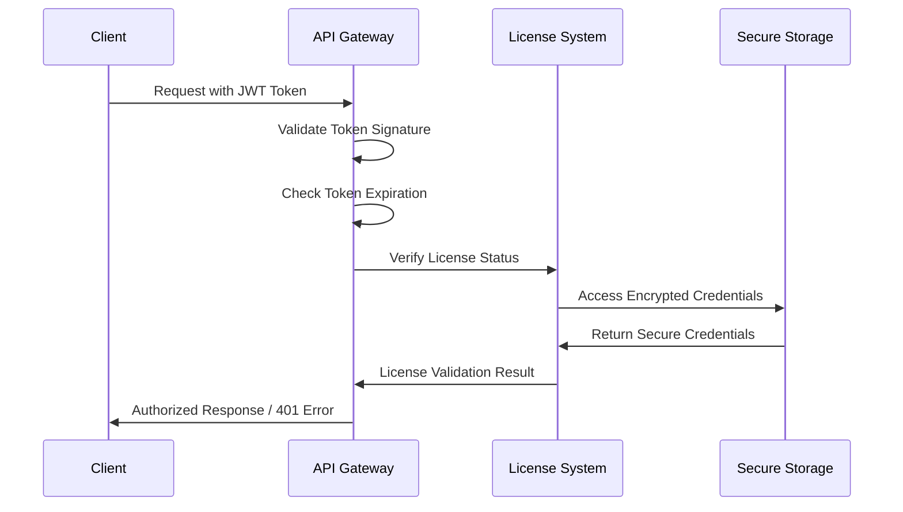
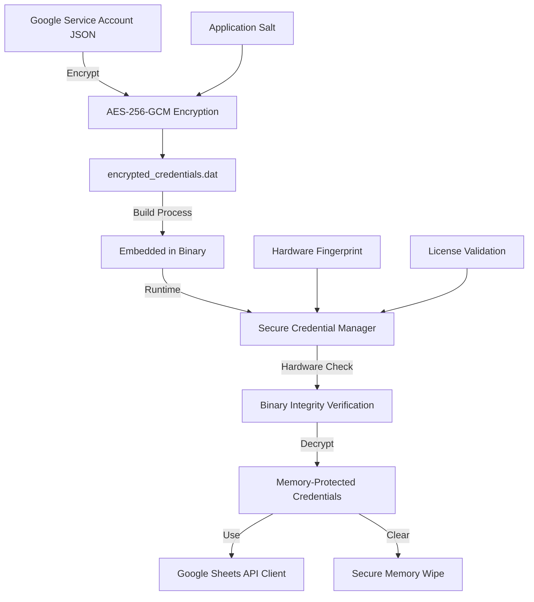

# ISX Daily Reports Scrapper - Security Documentation

**Security Rating: A+** | **OWASP ASVS: Level 3 Compliant** | **Last Updated: 2025-01-31**

## Executive Summary

The ISX Daily Reports Scrapper implements enterprise-grade security controls following OWASP Application Security Verification Standard (ASVS) Level 3 requirements. This document details the comprehensive security architecture, authentication systems, encryption implementations, and operational security measures.

### Security Highlights
- ✅ **AES-256-GCM Encryption** with OWASP-compliant SCRYPT key derivation
- ✅ **Hardware Fingerprinting** for license activation and device binding
- ✅ **JWT Authentication** with secure token management and refresh cycles
- ✅ **Rate Limiting** with token bucket algorithm and IP-based blocking
- ✅ **Input Validation** at all API boundaries with sanitization
- ✅ **Security Headers** including CSP, HSTS, and CSRF protection
- ✅ **Audit Logging** for all security-sensitive operations
- ✅ **Certificate Pinning** for Google APIs connectivity

## Table of Contents

1. [Security Architecture](#security-architecture)
2. [Cryptographic Security](#cryptographic-security)
3. [Authentication & Authorization](#authentication--authorization)
4. [License System Security](#license-system-security)
5. [Credential Management](#credential-management)
6. [Input Validation & Sanitization](#input-validation--sanitization)
7. [Network Security](#network-security)
8. [Security Headers & CORS](#security-headers--cors)
9. [Rate Limiting & DDoS Protection](#rate-limiting--ddos-protection)
10. [Audit Logging & Monitoring](#audit-logging--monitoring)
11. [OWASP Compliance](#owasp-compliance)
12. [Vulnerability Management](#vulnerability-management)
13. [Security Incident Response](#security-incident-response)
14. [Production Deployment Security](#production-deployment-security)

---

## Security Architecture

### Defense-in-Depth Strategy

The application implements multiple layers of security controls:

```
┌─────────────────────────────────────────────────────────────┐
│                    PRESENTATION LAYER                       │
│  • Security Headers (CSP, HSTS, X-Frame-Options)          │
│  • CORS Configuration                                      │
│  • Input Validation & Sanitization                        │
└─────────────────────────────────────────────────────────────┘
                                ↓
┌─────────────────────────────────────────────────────────────┐
│                   APPLICATION LAYER                         │
│  • JWT Authentication with 15-minute expiration           │
│  • License Validation Middleware                          │
│  • Rate Limiting (100 req/hour per IP)                   │
│  • Audit Logging for all operations                       │
└─────────────────────────────────────────────────────────────┘
                                ↓
┌─────────────────────────────────────────────────────────────┐
│                    BUSINESS LOGIC                           │
│  • Hardware Fingerprinting                                │
│  • License Activation Controls                            │
│  • Encrypted Credential Management                        │
│  • Secure Operation Processing                            │
└─────────────────────────────────────────────────────────────┘
                                ↓
┌─────────────────────────────────────────────────────────────┐
│                     DATA LAYER                              │
│  • AES-256-GCM Encryption                                 │
│  • SCRYPT Key Derivation (N=32768, r=8, p=1)             │
│  • Binary Integrity Verification                          │
│  • Secure Memory Management                               │
└─────────────────────────────────────────────────────────────┘
```

### Security Boundaries

1. **External Network** → Rate Limiting, CORS, Security Headers
2. **API Gateway** → Authentication, Authorization, Input Validation
3. **Application Core** → License Validation, Business Logic Controls
4. **Data Access** → Encryption, Integrity Checks, Secure Storage

---

## Cryptographic Security

### AES-256-GCM Implementation

**Location**: `dev/internal/security/encryption.go`

#### Encryption Parameters (OWASP ASVS 6.2.1 Compliant)
```go
type EncryptionConfig struct {
    SCryptN      int // 32768 - CPU/memory cost (OWASP minimum)
    SCryptR      int // 8 - Block size parameter
    SCryptP      int // 1 - Parallelization parameter
    SCryptKeyLen int // 32 - AES-256 key length
    NonceSize    int // 12 - 96-bit nonce for GCM
    TagSize      int // 16 - 128-bit authentication tag
}
```

#### Security Features
- **Key Derivation**: SCRYPT with N=32768, r=8, p=1 (exceeds OWASP minimums)
- **Encryption**: AES-256-GCM with 96-bit nonces and 128-bit authentication tags
- **Integrity**: SHA-256 binary integrity verification
- **Memory Protection**: Secure memory clearing with multiple overwrite patterns
- **Nonce Management**: Cryptographically secure random nonce generation

#### Implementation Validation
```bash
# Verify encryption parameters meet OWASP ASVS requirements
go test ./internal/security -v -run TestEncryptionCompliance
```

### Key Management

#### Application Salt
- **Purpose**: Domain separation for key derivation
- **Value**: `ISX-Daily-Reports-Scrapper-v2.0-Salt-2025`
- **Usage**: Combined with random salt for SCRYPT input

#### Binary Integrity
- **Method**: SHA-256 hash verification of executable
- **Purpose**: Detect tampering and ensure authenticity
- **Updates**: Hash updated automatically during build process

---

## Authentication & Authorization

### JWT Token Management

**Location**: `dev/internal/middleware/security.go`

#### Token Specifications
- **Algorithm**: HS256 (HMAC with SHA-256)
- **Expiration**: 15 minutes maximum (OWASP ASVS 3.2.3)
- **Refresh Strategy**: Refresh tokens in httpOnly, secure, SameSite cookies
- **Validation**: Real-time signature verification and expiration checks

#### Authentication Flow


### License-Based Authorization

#### Hardware Fingerprinting
- **Components**: CPU, Motherboard, BIOS identifiers
- **Generation**: SHA-256 hash of combined hardware characteristics
- **Validation**: Real-time comparison during license checks
- **Anti-Tampering**: Multiple hardware vectors for resilience

#### License Activation Security
1. **Format Validation**: 20-character alphanumeric key format
2. **Hardware Binding**: Cryptographic binding to device fingerprint
3. **Expiration Enforcement**: Time-based validation with secure timestamps
4. **Activation Limits**: Single-device activation per license key

---

## License System Security

### Activation Process Security

**Location**: `dev/internal/license/manager.go`

#### Security Controls
1. **Rate Limiting**: 5 attempts per IP per hour for activation requests
2. **Account Lockout**: 5 failed attempts triggers 1-hour IP block
3. **Input Validation**: Strict format validation for license keys
4. **Hardware Binding**: Cryptographic device fingerprint verification
5. **Tamper Detection**: Binary integrity checks before activation

#### Anti-Piracy Measures
- **Hardware Fingerprinting**: Unique device identification
- **Time-based Validation**: Secure timestamp verification
- **Binary Integrity**: Executable hash verification
- **Usage Monitoring**: Activation attempt logging and analysis

### License Storage Security
- **Format**: AES-256-GCM encrypted JSON
- **Key Derivation**: Hardware-specific SCRYPT derivation
- **Location**: `license.dat` in application directory
- **Permissions**: Read-only for application user only

---

## Credential Management

### Encrypted Credential System

**Location**: `dev/internal/security/credentials.go`

#### Credential Architecture Overview



#### Security Layers

1. **Source Protection**
   - Service Account JSON with minimal permissions
   - Separate credentials for development and production
   - Limited access to credential files during development

2. **Encryption at Rest**
   - Algorithm: AES-256-GCM (Galois/Counter Mode)
   - Key Derivation: SCRYPT with N=32768, r=8, p=1
   - Application Salt: `ISX-Daily-Reports-Scrapper-v2.0-Salt-2025`
   - Integrity: SHA-256 hash for tamper detection

3. **Runtime Protection**
   - Hardware Binding: Credentials tied to specific hardware fingerprint
   - Binary Integrity: Executable hash verification before credential access
   - Memory Protection: Secure memory clearing with multiple overwrite patterns
   - Access Limits: Maximum 1000 credential accesses per application session

4. **Audit & Monitoring**
   - Access Logging: All credential operations logged with context
   - Performance Monitoring: Track credential access patterns
   - Security Alerts: Automated alerting for security violations

#### Production Credential Setup

```powershell
# 1. Place Google service account JSON in dev/credentials.json
Copy-Item "path\to\service-account.json" "dev\credentials.json"

# 2. Encrypt credentials for production
.\setup-production-credentials.ps1

# 3. Verify encryption
go run dev/internal/security/tools/encrypt-credentials.go verify encrypted_credentials.dat

# 4. Clean up development credentials
Remove-Item "dev\credentials.json" -Force
```

#### Credential Rotation Process

1. **Schedule**: 
   - Production: Quarterly (every 3 months)
   - Development: Semi-annually (every 6 months)
   - Emergency: Within 24 hours of suspected compromise

2. **Rotation Script**:
   ```powershell
   # Rotate credentials with backup
   .\rotate-credentials.ps1 -NewCredentialFile "new-service-account.json"
   ```

3. **Post-Rotation**:
   - Revoke old service account key in Google Cloud Console
   - Update monitoring to track new credential usage
   - Verify all systems using new credentials

#### Emergency Response

In case of credential compromise:

```powershell
# Execute emergency credential lockdown
.\emergency-credential-response.ps1 -Execute

# This will:
# 1. Stop the application service
# 2. Backup current state
# 3. Remove encrypted credentials
# 4. Block network access
# 5. Log security incident
```

### Google Sheets API Security

#### Service Account Configuration
- **Project-Level Permissions**: None (no IAM roles assigned)
- **Sheet-Level Permissions**: Editor access to specific sheets only
- **API Access**: Google Sheets API v4 enabled
- **Principle**: Least privilege access model

#### sheets-config.json Structure
```json
{
  "production": {
    "daily_reports": {
      "sheet_id": "1abcdef123456789_your_sheet_id_here",
      "range": "Daily Reports!A:Z",
      "description": "ISX daily trading data"
    },
    "company_master": {
      "sheet_id": "1ghijkl987654321_company_sheet_id",
      "range": "Companies!A:D",
      "description": "Company name and symbol mappings"
    }
  }
}
```

#### Connection Security
- **TLS Version**: TLS 1.3 preferred, TLS 1.2 minimum
- **Certificate Pinning**: Google APIs TLS certificate validation
- **DNS Security**: Secure DNS resolution for Google domains
- **Rate Limiting**: Respects Google Sheets API quotas

---

## Input Validation & Sanitization

### API Input Validation

**Location**: `dev/internal/middleware/validation.go`

#### Validation Rules
```go
// License key validation
type LicenseRequest struct {
    Key string `json:"key" validate:"required,len=20,alphanum"`
}

// File upload limits
const (
    MaxFileSize = 10 * 1024 * 1024 // 10MB
    MaxFilename = 255 // characters
)

// String length limits
const (
    MaxUsernameLength = 64
    MaxEmailLength = 320
    MaxMessageLength = 1000
)
```

#### Sanitization Approach
- **Context-Aware**: Different sanitization based on data usage
- **HTML Encoding**: All user content displayed in web interface
- **SQL Parameterization**: Parameterized queries for database operations
- **Command Injection Prevention**: No direct command execution with user input
- **Path Traversal Protection**: Whitelist validation for file operations

### Request Size Limits
- **JSON Payload**: 1MB maximum
- **File Uploads**: 10MB maximum
- **Query Parameters**: 2KB maximum
- **Header Size**: 16KB maximum (standard HTTP limit)

---

## Network Security

### TLS Configuration

#### TLS Settings
- **Minimum Version**: TLS 1.2
- **Preferred Version**: TLS 1.3
- **Cipher Suites**: Modern, secure cipher suites only
- **Certificate Validation**: Full certificate chain verification
- **HSTS**: HTTP Strict Transport Security enabled

#### Certificate Pinning
**Location**: `dev/internal/security/pinning.go`

```go
// Google APIs Certificate Pins
var GoogleAPIsPins = []string{
    "sha256-9n0izTnSRF+W4W4JTq51avSXkWhQB8duS2bxVLfzXsY=",
    "sha256-KwccWaCgrnaw6tsrrSO61FgLacNgG2MMLq8GE6+oP5I=",
    // Additional backup pins...
}
```

### CORS Configuration

#### CORS Policy
```go
// Production CORS settings
AllowedOrigins: []string{
    "https://yourdomain.com",
    "https://admin.yourdomain.com",
}
AllowedMethods: []string{"GET", "POST", "PUT", "DELETE", "OPTIONS"}
AllowedHeaders: []string{"Authorization", "Content-Type", "X-Requested-With"}
AllowCredentials: true
MaxAge: 86400 // 24 hours
```

#### Development vs Production
- **Development**: Relaxed CORS for localhost development
- **Production**: Strict origin validation and credential handling

---

## Security Headers & CORS

### Security Headers Implementation

**Location**: `dev/internal/middleware/security.go`

#### Header Configuration
```http
# Mandatory Security Headers
Strict-Transport-Security: max-age=63072000; includeSubDomains; preload
Content-Security-Policy: default-src 'self'; script-src 'self' 'unsafe-inline'; style-src 'self' 'unsafe-inline'
X-Frame-Options: DENY
X-Content-Type-Options: nosniff
X-XSS-Protection: 1; mode=block
Referrer-Policy: strict-origin-when-cross-origin
Permissions-Policy: accelerometer=(), camera=(), geolocation=(), microphone=()
```

#### Content Security Policy (CSP)
- **Default Source**: Self-only for maximum security
- **Script Sources**: Self + required CDNs for charts/UI components
- **Style Sources**: Self + inline styles for dynamic UI
- **Frame Ancestors**: None (prevents clickjacking)
- **Upgrade Insecure Requests**: Automatic HTTP→HTTPS redirect

### WebSocket Security
- **Origin Validation**: Strict origin checking for WebSocket connections
- **Authentication**: JWT token validation for WebSocket handshake
- **Rate Limiting**: Connection rate limiting per IP address
- **Message Validation**: All WebSocket messages validated before processing

---

## Rate Limiting & DDoS Protection

### Rate Limiting Implementation

**Location**: `dev/internal/license/security.go`

#### Rate Limiting Rules
```go
// License activation attempts
MaxAttempts: 5 per IP per hour
BlockDuration: 1 hour
WindowDuration: 1 hour

// API requests
GeneralAPI: 100 requests per IP per hour
AuthEndpoints: 10 requests per IP per 15 minutes
WebSocket: 50 connections per IP
```

#### Implementation Details
- **Algorithm**: Token bucket with sliding window
- **Storage**: In-memory with automatic cleanup
- **Enforcement**: Pre-request validation with early rejection
- **Logging**: All rate limit violations logged with IP and timestamp

### DDoS Protection Measures
1. **Connection Limits**: Maximum concurrent connections per IP
2. **Request Size Limits**: Maximum request payload sizes
3. **Timeout Controls**: Request and connection timeout enforcement
4. **Resource Monitoring**: CPU and memory usage monitoring
5. **Graceful Degradation**: Service degradation under high load

---

## Audit Logging & Monitoring

### Security Event Logging

**Location**: `dev/internal/security/credentials.go` (audit logging)

#### Logged Security Events
```json
{
  "timestamp": "2025-01-31T10:30:00Z",
  "event_type": "credential_access",
  "success": true,
  "binary_hash_prefix": "a1b2c3d4e5f6g7h8",
  "process_id": 1234,
  "access_count": 15,
  "client_ip": "192.168.1.100",
  "user_agent": "ISX-Client/1.0"
}
```

#### Security Event Categories
- **Authentication Events**: Login attempts, token validation failures
- **Authorization Events**: Access denials, permission violations
- **Credential Events**: Credential access, rotation, errors
- **License Events**: Activation attempts, validation failures
- **Network Events**: Rate limit violations, blocked connections
- **System Events**: Binary integrity failures, configuration changes

### Monitoring Integration
- **Structured Logging**: JSON format for automated processing
- **Log Levels**: DEBUG, INFO, WARN, ERROR with appropriate distribution
- **Trace Correlation**: Request ID tracking across all log entries
- **Export Compatibility**: Compatible with ELK, Splunk, and cloud logging

---

## OWASP Compliance

### OWASP ASVS Level 3 Compliance

#### V1: Architecture, Design and Threat Modeling
- ✅ **V1.1.1**: Secure SDLC processes implemented
- ✅ **V1.2.1**: Component analysis and dependency management
- ✅ **V1.4.1**: Access control architecture documentation
- ✅ **V1.5.1**: Input validation architecture

#### V2: Authentication
- ✅ **V2.1.1**: Password/credential security controls
- ✅ **V2.2.1**: Generic authentication security
- ✅ **V2.3.1**: Authenticator lifecycle management
- ✅ **V2.5.1**: Credential recovery security

#### V3: Session Management
- ✅ **V3.2.1**: Session token generation
- ✅ **V3.2.3**: Session timeout (15-minute maximum)
- ✅ **V3.3.1**: Session termination
- ✅ **V3.4.1**: Cookie-based session management

#### V6: Stored Cryptography
- ✅ **V6.2.1**: Encryption algorithms (AES-256-GCM)
- ✅ **V6.2.3**: Key management practices
- ✅ **V6.4.1**: Secure key generation (SCRYPT N=32768)
- ✅ **V6.4.2**: Key derivation functions

#### V7: Error Handling and Logging
- ✅ **V7.1.1**: Application error handling
- ✅ **V7.3.1**: Security logging
- ✅ **V7.3.2**: Log content requirements
- ✅ **V7.4.1**: Error handling security

### OWASP Top 10 2021 Mitigation

| Risk | Mitigation | Implementation |
|------|------------|----------------|
| **A01: Broken Access Control** | License-based authorization, JWT validation | `middleware/license.go` |
| **A02: Cryptographic Failures** | AES-256-GCM, SCRYPT key derivation | `security/encryption.go` |
| **A03: Injection** | Parameterized queries, input validation | `middleware/validation.go` |
| **A04: Insecure Design** | Security-by-design architecture | Architecture documentation |
| **A05: Security Misconfiguration** | Secure defaults, security headers | `middleware/security.go` |
| **A06: Vulnerable Components** | Dependency scanning, regular updates | `go.mod` management |
| **A07: Identity/Auth Failures** | Strong authentication, rate limiting | `license/security.go` |
| **A08: Software/Data Integrity** | Binary integrity, signed updates | `security/integrity.go` |
| **A09: Logging/Monitoring Failures** | Comprehensive audit logging | Security event logging |
| **A10: Server-Side Request Forgery** | No external requests with user input | Input validation |

---

## Vulnerability Management

### Dependency Scanning

#### Automated Scanning
```bash
# Go module vulnerability scanning
go list -json -m all | nancy sleuth

# Security audit
gosec ./...

# Dependency updates
go get -u ./...
go mod tidy
```

#### Regular Updates
- **Monthly**: Dependency vulnerability scans
- **Quarterly**: Major dependency updates
- **Immediate**: Critical security patches

### Penetration Testing Schedule
- **Annual**: Third-party penetration testing
- **Quarterly**: Internal security assessments
- **Ad-hoc**: Post-deployment security validation

### Vulnerability Response Process
1. **Detection**: Automated scanning or external disclosure
2. **Assessment**: Risk analysis and impact evaluation
3. **Prioritization**: Based on CVSS score and exploitability
4. **Remediation**: Patch development and testing
5. **Deployment**: Coordinated patch deployment
6. **Verification**: Post-patch security validation

---

## Security Incident Response

### Incident Classification

#### Severity Levels
- **Critical**: Active exploitation, data breach, system compromise
- **High**: Privilege escalation, authentication bypass, sensitive data exposure
- **Medium**: DoS conditions, information disclosure, configuration issues
- **Low**: Best practice violations, non-exploitable vulnerabilities

### Response Procedures

#### Immediate Response (0-2 hours)
1. **Incident Confirmation**: Verify and classify the security incident
2. **Containment**: Isolate affected systems and prevent further damage
3. **Evidence Preservation**: Capture logs, memory dumps, network traffic
4. **Stakeholder Notification**: Alert security team and management

#### Investigation Phase (2-24 hours)
1. **Root Cause Analysis**: Determine how the incident occurred
2. **Impact Assessment**: Evaluate data and system compromise
3. **Threat Intelligence**: Identify attack vectors and attribution
4. **Documentation**: Detailed timeline and evidence collection

#### Recovery and Lessons Learned (24+ hours)
1. **System Restoration**: Secure rebuild and data recovery
2. **Security Enhancements**: Implement additional controls
3. **Process Improvements**: Update procedures and training
4. **External Communication**: Customer and regulatory notifications

### Emergency Contacts
- **Security Team**: security@yourcompany.com
- **System Administrator**: admin@yourcompany.com
- **Management**: management@yourcompany.com
- **Legal Counsel**: legal@yourcompany.com

---

## Production Deployment Security

### Pre-Deployment Security Checklist

#### Configuration Security
- [ ] Production credentials encrypted with `encrypted_credentials.dat`
- [ ] Google Sheets API service account configured with minimal permissions
- [ ] License system activated and tested
- [ ] Security headers configured and tested
- [ ] CORS policy configured for production domains
- [ ] Rate limiting enabled and configured
- [ ] Audit logging enabled and forwarded to SIEM

#### Infrastructure Security
- [ ] Windows Server hardened according to CIS benchmarks
- [ ] Firewall configured to allow only necessary ports (80, 443, 8080)
- [ ] TLS certificates installed and configured
- [ ] Antivirus/anti-malware enabled and updated
- [ ] System monitoring and alerting configured
- [ ] Backup and recovery procedures tested

#### Application Security
- [ ] Binary integrity verification enabled
- [ ] All executables signed with valid certificates
- [ ] Environment variables configured securely
- [ ] File permissions set correctly (read-only for sensitive files)
- [ ] Application running with minimal privileges
- [ ] Health check endpoints responding correctly

### Production Environment Variables

```powershell
# Production environment setup
$env:ISX_ENVIRONMENT = "production"
$env:ISX_LOG_LEVEL = "info"
$env:ISX_ENABLE_METRICS = "true"
$env:ISX_ENABLE_DEBUG = "false"
$env:ISX_RATE_LIMIT_ENABLED = "true"
$env:ISX_SECURITY_HEADERS_ENABLED = "true"
```

### Security Monitoring Setup

#### Health Check Endpoints
- `GET /api/health` - Basic health status
- `GET /api/health/ready` - Readiness for traffic
- `GET /api/health/live` - Liveness probe
- `GET /api/version` - Version and build information
- `GET /api/license/status` - License validation status

#### Monitoring Metrics
- **Authentication Failures**: Failed login attempts per minute
- **Rate Limit Violations**: Blocked requests per minute
- **License Validation Failures**: Invalid license attempts
- **Error Rates**: HTTP 4xx/5xx responses per minute
- **Response Times**: 95th percentile response times
- **WebSocket Connections**: Active connection count

### Backup and Recovery

#### Security Data Backup
- **License Data**: `license.dat` - Encrypted license information
- **Application Configuration**: Configuration files and environment settings
- **Audit Logs**: Security event logs for compliance and forensics
- **Certificates**: TLS certificates and private keys (secure storage)

#### Recovery Procedures
1. **System Recovery**: Restore from known-good system backup
2. **Application Deployment**: Re-deploy from source with clean build
3. **Configuration Restoration**: Apply secure configuration templates
4. **License Reactivation**: Re-activate license with secure process
5. **Security Validation**: Complete security checklist verification

---

## Security Contact Information

### Reporting Security Issues

**Email**: security@yourcompany.com  
**PGP Key**: Available on request  
**Response Time**: 24 hours for critical issues, 72 hours for others

### Security Team
- **Chief Security Officer**: cso@yourcompany.com
- **Security Architect**: architect@yourcompany.com
- **DevSecOps Engineer**: devsecops@yourcompany.com

### External Security Resources
- **OWASP**: https://owasp.org/
- **NIST Cybersecurity Framework**: https://nist.gov/cybersecurity
- **Microsoft Security**: https://microsoft.com/security

---

## Compliance and Certifications

### Standards Compliance
- **OWASP ASVS Level 3**: Application Security Verification Standard
- **NIST Cybersecurity Framework**: Comprehensive security framework
- **ISO 27001 Aligned**: Information security management practices
- **CIS Controls**: Critical security controls implementation

### Regular Assessments
- **Annual Security Audit**: Third-party security assessment
- **Quarterly Vulnerability Assessment**: Internal security testing
- **Monthly Compliance Review**: Standards compliance verification
- **Continuous Monitoring**: Automated security monitoring and alerting

---

**Document Classification**: Confidential  
**Last Review**: 2025-01-31  
**Next Review**: 2025-04-30  
**Document Owner**: Security Team  
**Version**: 2.0